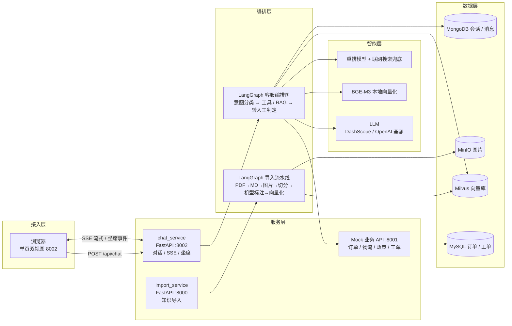

# 智服3D（Zhifu3D）· 企业级智能客服系统

基于 **RAG + LangGraph 多 Agent** 的 3D 打印机售后智能客服系统。系统以本地知识库（用户手册 / FAQ / 售后政策 / 故障排查）为核心，通过意图识别、工具调用、检索增强与转人工协同，提供「用户自助答疑 → 坐席工单」的完整闭环，配套单页双视图演示控制台与坐席工作台。

## 项目背景

3D 打印机售后场景中，客服面对的是大量重复性、强依赖文档的问题：安装步骤、常见故障、售后政策、物流与保修查询。传统客服存在响应慢、口径不一、知识分散、工单记录不规范等痛点。本项目尝试用工程化方式解决这些问题：

- **知识沉淀**：PDF 手册、FAQ、政策等多源文档自动解析、切分、向量化入库；
- **自动应答**：多 Agent 编排，先工具查询后知识检索，答案带引用、内联图片、条理分步；
- **无缝转人工**：自动识别投诉 / 连续未解决等场景，生成摘要与工单草稿，坐席一键接手；
- **演示友好**：一套进程内完成对话、坐席、工单全链路，单页双视图便于答辩演示。

## 技术架构



## 核心功能

**多 Agent 客服编排**

- 意图分类：咨询 / 故障 / 售后 / 投诉四类，决定后续路由；
- 工具 Agent：订单查询、物流跟踪、退换货政策、保修查询（规则优先、LLM 兜底）；
- RAG Agent：机型确认（候选机型不阻断，作为检索过滤条件）→ 多路检索 → RRF 融合 → 精排 → 答案生成；
- 转人工：投诉、显式要求、连续两轮未解决、工具失败等触发，自动生成摘要与工单草稿。

**检索增强（RAG）**

- 原句 + HyDE + 联网兜底三路召回，RRF 融合与重排；
- 答案「先结论、分步骤」，引用锚定来源，图片按真实语料内联（`<refs>` 声明机制）；
- 引用仅用于可追溯性，用户端不渲染引用行，回答精简不寒暄。

**坐席工作台**

- 三栏布局：左「转人工队列」/ 中「聊天区」/ 右「已接待客户」；
- 领取 / 人工回复 / 关闭会话；分类与机型下拉；工单草稿一键展开；
- 会话 ID 落工单，上下文卡片带 AI 摘要，点击可回看历史客户完整聊天记录。

**知识导入**

- PDF → Markdown（MinerU2）→ 图片抽取 → 文档切分 → 机型 / 知识类型标注 → BGE-M3 向量化 → Milvus；
- 机型目录管理、幂等重导、任务状态查询，检索与导入两个 LangGraph 流水线解耦。

**前端演示控制台**

- 单页双视图（左侧用户聊天、右侧坐席工作台），SSE 流式输出，Style D「青屿清爽」主题。

## 技术栈

| 层 | 技术 |
| --- | --- |
| 语言 | Python 3.11+ / 原生 JavaScript |
| Web 框架 | FastAPI、Uvicorn、SSE（Server-Sent Events） |
| Agent 编排 | LangGraph、LangChain（状态图多 Agent） |
| LLM | 阿里云 DashScope（qwen 系列）/ 任意 OpenAI 兼容端点 |
| 向量检索 | Milvus 2.4、BGE-M3（FlagEmbedding）、HyDE、RRF、重排模型 |
| 文档解析 | MinerU2（PDF → Markdown）、langchain-text-splitters |
| 存储 | MongoDB（会话 / 消息）、MySQL（业务 / 工单）、MinIO（图片）、Etcd |
| 前端 | HTML / CSS / JavaScript 单页双视图 |
| 部署 | Docker Compose（Mongo / MySQL / MinIO / Etcd / Milvus / Attu） |
| 依赖管理 | uv（pyproject.toml / uv.lock）+ requirements.txt |

## 快速开始

```powershell
# 1. 启动依赖容器
docker compose up -d

# 2. 复制并填写环境变量
copy .env.example .env

# 3. 安装依赖
python -m venv .venv
.\.venv\Scripts\activate
pip install -r requirements.txt

# 4. 启动三个服务（隐藏窗口或三个终端）
.\.venv\Scripts\python.exe -m backend.mock_business_api.main   # 8001 Mock 业务 API
.\.venv\Scripts\python.exe -m backend.web.chat_service         # 8002 对话 + 坐席 + 前端
.\.venv\Scripts\python.exe -m backend.web.import_service       # 8000 知识导入
```

打开 <http://127.0.0.1:8002/>：左侧用户对话、右侧坐席工作台。

## 环境要求

- 操作系统：Windows 10/11 或 Linux；
- Python 3.11+；
- Docker Desktop（Compose v2）；
- 内存 ≥ 16 GB（本地 BGE-M3 与 MinerU 推理；CPU 模式较慢，GPU 可选加速）；
- 磁盘：源码仅数 MB，本地模型权重约 8 GB（BGE-M3 / MinerU2 / PDF-Extract-Kit），知识语料约 1 GB；
- LLM 服务：阿里云百炼 DashScope API Key，或任意 OpenAI 兼容接口地址与 Key；
- 可选：MinerU 解析服务（用于 PDF 知识导入，见 `.env.example` 中 `MINERU_*` 配置）。

## 安装步骤

1. 克隆仓库并进入目录：

   ```bash
   git clone <repo-url> zhifu3d
   cd zhifu3d
   ```

2. 创建虚拟环境并安装依赖：

   ```powershell
   python -m venv .venv
   .\.venv\Scripts\activate        # Linux: source .venv/bin/activate
   pip install -r requirements.txt
   ```

3. 配置环境变量：

   ```powershell
   copy .env.example .env
   ```

   在 `.env` 中至少填写：`OPENAI_API_BASE`、`OPENAI_API_KEY`、`LLM_DEFAULT_MODEL`；使用联网搜索与重排需填写 `DASHSCOPE_API_KEY`。

4. 启动依赖容器：

   ```bash
   docker compose up -d
   ```

5. 准备本地模型（向量化必需）：

   ```bash
   modelscope download --model BAAI/bge-m3
   ```

   并将 `.env` 的 `BGE_M3_PATH` 指向下载后的权重目录；PDF 导入所需的 MinerU 模型与解析服务按需配置。

6. 导入知识库：启动 `import_service` 后，通过 8002 控制台的上传入口（或 `POST http://127.0.0.1:8000/api/upload`）上传 PDF / Markdown，按页面提示选择知识类型与机型。

## 运行项目

```powershell
# 三个服务分别启动（默认监听 127.0.0.1）
.\.venv\Scripts\python.exe -m backend.mock_business_api.main   # :8001
.\.venv\Scripts\python.exe -m backend.web.chat_service         # :8002
.\.venv\Scripts\python.exe -m backend.web.import_service       # :8000
```

| 服务 | 端口 | 说明 |
| --- | --- | --- |
| `mock_business_api` | 8001 | 订单 / 物流 / 退换政策 / 保修 / 工单（MySQL） |
| `chat_service` | 8002 | `POST /api/chat`、`GET /api/stream/{id}` SSE、坐席 API、静态前端 |
| `import_service` | 8000 | `GET /api/catalog`、`POST /api/upload`、`GET /api/status/{task_id}` |

健康检查：`GET /health`（三个服务均返回 `{"ok":true}`）。

## 项目结构

```text
zhifu3d/
├── backend/
│   ├── service/                 # 客服编排（LangGraph）：意图 / 工具 / RAG / 转人工
│   │   ├── nodes/               # intent / tool_agent / rag_agent / escalation / reply
│   │   ├── tools/               # 订单 / 物流 / 政策 / 保修 / 工单工具
│   │   └── prompt/              # 意图与答案提示词
│   ├── processor/               # 知识导入与查询流水线（LangGraph 节点）
│   │   ├── import_processor/    # PDF→MD→图片→切分→标注→向量化→Milvus
│   │   └── query_processor/     # 机型确认→多路检索→RRF→重排→答案生成
│   ├── mock_business_api/       # Mock 业务 API（8001，MySQL 数据）
│   ├── config/                  # LLM / 向量 / 存储 / 业务等配置
│   ├── utils/                   # Milvus / Mongo / MinIO / SSE / 会话等工具层
│   └── web/                     # FastAPI：chat(8002) / import(8000) / 坐席路由
├── frontend/                    # 单页双视图前端（用户端 + 坐席台，Style D）
├── data/                        # 知识库语料（raw / processed，本地维护，不入库）
├── model/                       # BGE-M3 / MinerU 模型权重缓存（本地维护，不入库）
├── docker-compose.yml           # Mongo / MySQL / MinIO / Etcd / Milvus / Attu
├── requirements.txt             # pip 依赖清单
├── pyproject.toml               # uv 项目定义与依赖
├── uv.lock                      # uv 锁定文件
├── .env.example                 # 环境变量模板
├── AGENTS.md                    # AI 工程协作规则（供 AI 编码代理参考）
├── LICENSE                      # MIT 许可证
└── README.md
```

> 说明：根目录的 `CONTEXT.md`、PRD 文档与 `docs/` 为本地维护文档（`.gitignore` 已忽略，不入仓库），故未列入上方结构。

## 效果指标

基于 80 条评测集（覆盖咨询 / 故障 / 售后 / 投诉与转人工场景）：

| 指标 | 结果 | 阈值 |
| --- | --- | --- |
| 检索命中率 | 100%（64/64） | ≥ 90% |
| 回答准确率 | 95%（76/80） | ≥ 85% |
| 自动解决率 | 95%（76/80） | ≥ 70% |

## 许可证

[MIT](./LICENSE)
